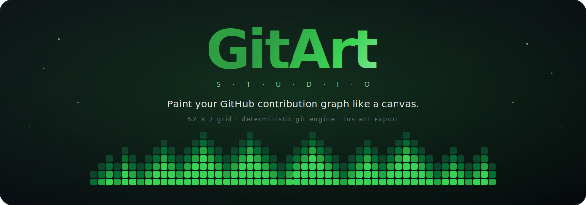

<p align="center">
  
</p>

<h1 align="center">GitArt Studio</h1>

<p align="center">
  A browser-based canvas for <em>painting</em> your GitHub contribution graph.
  <br />
  Design a 52&times;7 heatmap, then export a ready-to-push Git repository whose commit history
  reproduces that exact pattern on your real profile.
</p>

<p align="center">
  <a href="https://nextjs.org"></a>
  <a href="https://react.dev"></a>
  <a href="https://www.typescriptlang.org"></a>
  <a href="https://tailwindcss.com"></a>
</p>

---

## What is GitArt?

GitHub's profile page renders your commit activity as a **52-week &times; 7-day heatmap**, where
each cell's color depends on how many commits you authored that day. GitArt lets you treat that
grid as a **painter's canvas**: pick colors, draw a design, and the app builds a Git repository
whose commit timestamps render your design on the graph when pushed.

No fake identities, no GitHub API calls, no server writes. Everything is assembled **entirely in
your browser** using an in-memory filesystem and `isomorphic-git`, then handed back to you as a
single `heatmap-art.zip`. You push it yourself, with your own account, to a fresh empty repo.

---

## The whole process, end to end

The user journey is intentionally linear, but a surprising amount of work happens between the
"design" and "download" steps. Here is the full pipeline:

### 1. Design on a 52 &times; 7 canvas

The Studio renders a `<div>` grid that mirrors GitHub's contribution graph exactly &mdash; 52
columns (weeks), 7 rows (Sun &rarr; Sat). Every cell has an **intensity value from 0 to 4**:

| Intensity | Canvas color   | Commits/day |
|-----------|----------------|-------------|
| 0         | Empty          | 0           |
| 1         | Lightest theme | 1           |
| 2         | Light          | 5           |
| 3         | Mid            | 10          |
| 4         | Brightest      | 20          |

That mapping lives in `src/lib/gitEngine.ts` as `INTENSITY_COMMITS`. It is tuned so even the
brightest cell (20 commits) stays well within GitHub's "active user" bucket, so your graph looks
dramatic without looking synthetic.

### 2. Pick your tools

The bottom dock hosts a **brush** (levels 0&ndash;4) and an **eraser**. The canvas supports:

- **Click & drag** to paint strokes
- **Drop-in images** &mdash; any PNG/JPG is downsampled and quantized to 5 intensity bands by
  `src/lib/imageProcessor.ts`
- **Text &rarr; pixels** &mdash; type a word, `src/lib/fontMatrix.ts` maps each character through a
  bitmap font and stamps it onto the grid
- **Template Library** &mdash; 30+ hand-designed patterns in `src/lib/templates.ts` (Stonks, Nyan
  Trail, Crewmate, Pac-Man Chase, QR Code, Matrix Rain, Lightning Bolt, Christmas Tree, Fireworks,
  and many more), each built as a deterministic `number[]` of length 364
- **Themes** &mdash; preview the canvas in Classic Green, Halloween Orange, or Neon Purple
  (aesthetic only &mdash; the exported commits are identical)

### 3. Choose a target year &mdash; the "Time Machine"

GitHub's graph is anchored to a specific 52-week window. GitArt lets you target **any year between
2022 and 2027**. The app anchors commits to the **first Sunday of that year** (found by walking
forward from Jan&nbsp;1 until `getUTCDay() === 0`), so column 0 always lines up with GitHub's
leftmost column. From that anchor, `page.tsx` walks forward day-by-day through all 364 cells,
pairing each cell's intensity with its ISO date.

### 4. Enter your GitHub email

The email becomes the **`author.email`** on every generated commit. GitHub only attaches commits to
your profile if the author email matches one registered on your account &mdash; so this step is
non-negotiable. GitArt never sends it anywhere; it's written directly into the commit objects in
memory.

### 5. Click Download &mdash; the Git engine runs

This is where the magic happens. `generateHeatmapRepo()` in `src/lib/gitEngine.ts`:

1. **Spins up a virtual filesystem** with `memfs` (no disk I/O).
2. Runs **`git.init()`** from `isomorphic-git` against that fake FS.
3. Iterates over all 364 cells. For each cell with `intensity > 0`:
   - Appends a line to `log.txt` (so the tree actually changes between commits).
   - Runs `git.add()` &mdash; staging the new content.
   - Runs `git.commit()` with both `author.timestamp` and `committer.timestamp` pinned to noon UTC
     of that cell's date, and the configured author email.
   - Loops `INTENSITY_COMMITS[intensity]` times, so a level-4 cell produces **20** commits on that
     same date.
4. **Walks the in-memory tree** and pipes every file (including `.git/`) through **JSZip** to
   produce a real, downloadable zip.

The result: a zip whose git history, when pushed to GitHub, renders your painting pixel-for-pixel.

### 6. Push from your machine

The success modal shows the three commands you run after unzipping:

```bash
git remote add origin <YOUR_NEW_REPO_URL>
git branch -M main
git push -u origin main
```

Within a few minutes GitHub reconciles the contributions and your graph updates.
**Important:** push to a *brand-new empty repo* &mdash; the engine creates the initial history, so
there's nothing to merge with.

---

## Tech stack

| Layer              | Choice                                                                   |
|--------------------|--------------------------------------------------------------------------|
| Framework          | [Next.js 16](https://nextjs.org) (App Router, client components)         |
| UI                 | [React 19](https://react.dev) + [Tailwind CSS 4](https://tailwindcss.com)|
| Language           | [TypeScript 5](https://www.typescriptlang.org)                           |
| Git engine         | [`isomorphic-git`](https://isomorphic-git.org) running in the browser    |
| Virtual filesystem | [`memfs`](https://github.com/streamich/memfs)                            |
| Zipping            | [`jszip`](https://stuk.github.io/jszip/)                                 |
| Linting            | ESLint 9 with `eslint-config-next`                                       |

No backend, no database, no analytics. The app is a static export-ready SPA.

---

## Getting started

```bash
npm install

npm run dev

npm run build
npm run start

npm run lint
```

Node 20+ is recommended. Visit `http://localhost:3000` after `npm run dev`.

---

## Project structure

```
gitart/
├── public/
│   └── banner.svg               # the README banner you see above
├── scripts/
│   └── gen-banner.mjs           # regenerates the banner SVG
├── src/
│   ├── app/
│   │   ├── page.tsx             # Studio + Discover tabs, canvas, controls
│   │   ├── layout.tsx
│   │   └── globals.css
│   ├── components/
│   │   ├── CustomDropdown.tsx   # portal-based glassmorphic dropdown
│   │   ├── Modal.tsx            # copyable-code success modal
│   │   └── TemplateGallery.tsx  # Discover tab with template previews
│   └── lib/
│       ├── gitEngine.ts         # in-browser git + memfs + zip pipeline
│       ├── templates.ts         # 30+ 52x7 heatmap designs
│       ├── fontMatrix.ts        # bitmap font for text-to-pixels
│       └── imageProcessor.ts    # image -> 5-band quantized grid
└── package.json
```

---

## How the grid is stored

Every tool in the library speaks the same language: a **`number[]` of length 364** indexed in
**column-major** order:

```ts
const WEEKS = 52;
const DAYS = 7;
grid[col * DAYS + row] = intensity; // 0..4
```

Column-major matches GitHub's rendering (each contribution column = one calendar week), and makes
the "render a bitmap sprite at column C, row R" primitives in `templates.ts` trivial to write.

---

## Template library

Templates are deterministic functions that return a 364-length grid. Highlights:

- **Viral & Pop Culture** &mdash; Stonks, Nyan Trail, Crewmate, Wordle, The X
- **Trending** &mdash; QR Code, Matrix Rain, Rocket Launch, Barcode
- **Creative** &mdash; Lightning Bolt, Mountain Range, Coffee Cup, Christmas Tree, Heart Beat,
  Snake Game, Fireworks, Fire Flames
- **Classics** &mdash; Pac-Man Chase, Dino Run, Tetris Drop, Lightsaber, City Skyline, Audio
  Equalizer, DNA Helix, Space Invader, Heart, Smiley, Wave, Diamond Row, Checkerboard, Stripes,
  Solid Border

Pick one from the Discover tab &rarr; *Edit in Studio* drops it onto the canvas for further
tweaking, or *Quick Download* skips straight to export.

---

## Regenerating the banner

The banner at the top of this file is a generated SVG. It lives at `public/banner.svg` and is
regenerated by:

```bash
node scripts/gen-banner.mjs public/banner.svg
```

The script emits 245 rounded `<rect>`s laid out as a 52&times;7 audio-equalizer silhouette, plus
the gradient title, subtitle, and ambient glow.

---

## A note on ethics

GitArt does not fake contributions &mdash; every commit is authored by **you**, to **your own
repo**, with **your own email**. What it automates is the tedium of picking 364 dates and running
`git commit` 245+ times by hand. Whether that counts as "real work" is a philosophical question
this tool happily leaves to you.

What it will *not* do: author commits as someone else, contribute to someone else's repository, or
touch the network on your behalf.

---

## License

MIT. Feel free to fork, remix, and paint.
